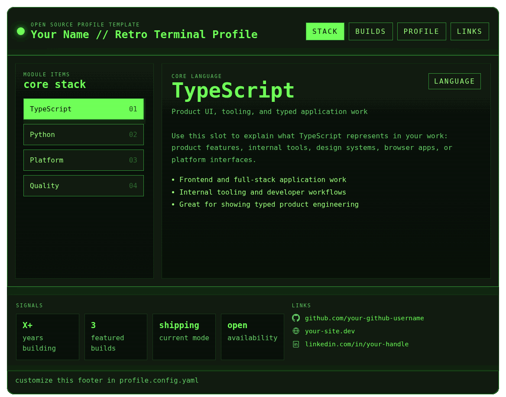
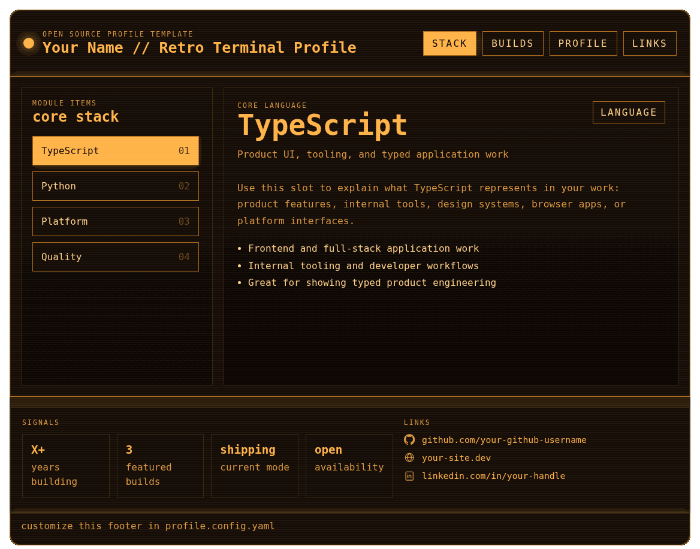
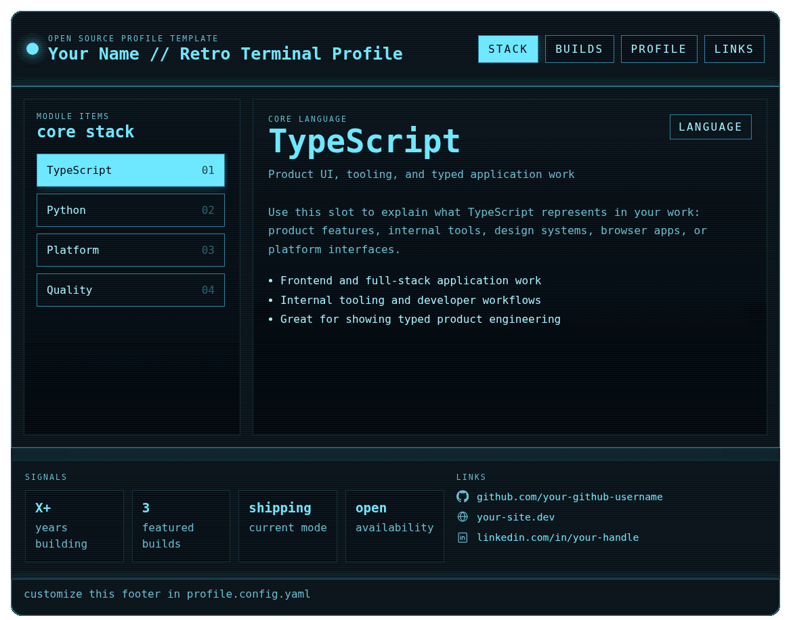
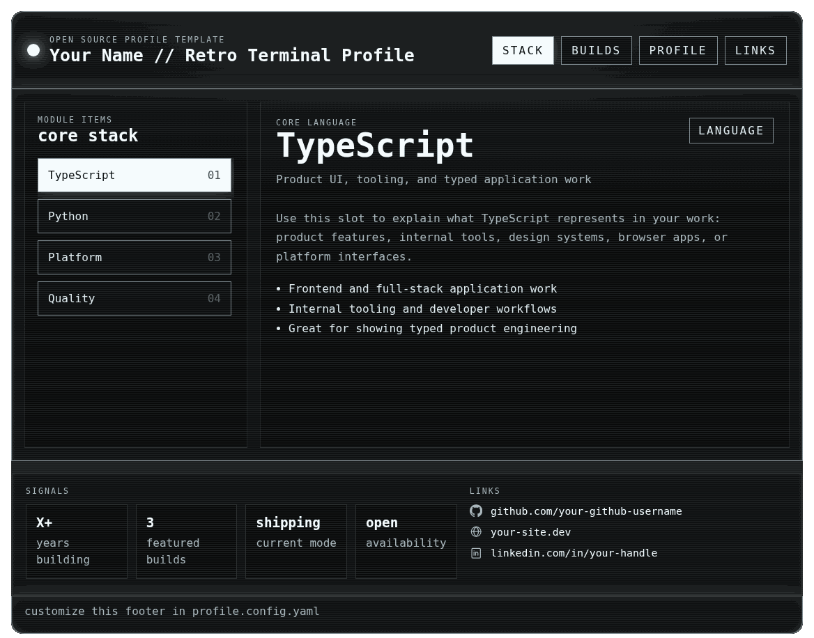

# Retro Terminal Profile

YAML-driven retro terminal profile template for GitHub. Edit one config file, preview locally, then export a static SVG plus an animated GIF teaser for your public profile README.

## What you get

- one editable source of truth in `profile.config.yaml`
- local interactive preview with `npm run dev`
- generated `CONFIG.md` reference after every config sync
- export assets in `assets/`
- optional sync of the GIF into your public profile repository

## Quick start

```bash
npm install
npm run dev
```

Then open the local preview, edit `profile.config.yaml`, and rerun:

```bash
npm run config
```

When you are happy with the result:

```bash
npm run export
```

`npm install` provisions the Playwright browser locally for this project, and `npm run export` re-checks it automatically if needed.

## Edit these files

- `profile.config.yaml` for your content, links, labels, and export options
- `scripts/theme-presets.json` if you want to add or change palettes

Everything else is generated or implementation code.

## Commands

- `npm run config` syncs the YAML, rebuilds generated artifacts, and regenerates `CONFIG.md`
- `npm run dev` runs config first, then starts the local preview server
- `npm run export` runs config, regenerates export assets, then tries to sync the public GIF teaser to your GitHub profile repo
- `npm run showcase` regenerates the README preview GIFs for themes and timing examples

## Theme preset previews

| Vault Green | Amber Radar |
| --- | --- |
|  |  |

| Arctic Signal | Mono Slate |
| --- | --- |
|  |  |

All four previews use the same sample content and the same `stepDelayMs: 1400`, so the palette is the only thing that changes.

## GIF timing previews

| `700 ms` | `1400 ms` | `2400 ms` |
| --- | --- | --- |
|  |  |  |

- `700 ms` = fast
- `1400 ms` = balanced
- `2400 ms` = slow and more readable

These showcase assets can be refreshed anytime with `npm run showcase`.

## Hosting the interactive app on GitHub Pages

Yes — you can host the interactive version on GitHub Pages.

There is no real backend here. `scripts/dev-server.mjs` is only a local static preview server for development. The app itself is plain static HTML, CSS, JS, and generated data files, so GitHub Pages can serve it directly.

Recommended flow:

1. run `npm run config`
2. commit the generated files
3. push the repo
4. in GitHub, enable **Settings > Pages**
5. deploy from `main` / root

Notes:

- if the repo is `your-github-username.github.io`, the site is served at the root domain
- if it is a normal repo, Pages serves it at `https://your-github-username.github.io/repo-name/`
- rerun `npm run config` before pushing config changes so Pages always gets fresh generated data
- `npm run export` is still useful for the GIF used in your public profile README

## Before you publish your fork

Replace the obvious placeholders in `profile.config.yaml`:

- `your-github-username`
- `Your Name`
- `your-site.dev`
- `your-handle`

If you forget, the template still works locally, but the exported content will obviously still look like a template.

## Publishing to your GitHub profile

Your GitHub profile README only appears when the repository name exactly matches your username.

Typical setup:

1. Fork or clone this repo.
2. Edit `profile.config.yaml`.
3. Create a separate public repository named exactly like your GitHub username.
4. Set `owner` in `profile.config.yaml` to that username.
5. Run `npm run export`.

By default, the export flow looks for a sibling repository matching `owner` and copies `assets/profile-teaser.gif` there.

If your profile repo lives somewhere else, override the target path:

- macOS/Linux: `PROFILE_REPO_PATH=/absolute/path/to/profile-repo npm run export`
- Windows CMD: `set PROFILE_REPO_PATH=C:\path\to\profile-repo && npm run export`
- PowerShell: `$env:PROFILE_REPO_PATH='C:\path\to\profile-repo'; npm run export`

If no target profile repo is found, export still succeeds and keeps the generated assets locally in `assets/`.

## Minimal public README snippet

Use this in your public profile repository:

```md
<h1 align="center">Your Name</h1>

<p align="center">
  
</p>
```

## Configuration highlights

- `themePreset` controls colors through named presets only
- `teaserGif.stepDelayMs` controls the GIF pacing
- `crtEffects` now keeps only fixed horizontal scanlines
- social icons are auto-detected from URLs and labels

For the full generated reference, see `CONFIG.md`.

## Corporate network / self-signed certificate issue

If Playwright downloads fail with `SELF_SIGNED_CERT_IN_CHAIN`, your company proxy is likely intercepting TLS.

Recommended fix on Windows:

```bat
npm config set cafile "C:\certs\corp-root.pem"
setx NODE_EXTRA_CA_CERTS "C:\certs\corp-root.pem"
node node_modules\playwright\cli.js install chromium
```

Then reopen your terminal and run:

```bat
npm run export
```

Avoid disabling TLS verification globally.

## Notes

- this project keeps an original retro-terminal direction and does not include proprietary game UI
- `package.json` is marked `private` only to avoid accidental npm publishing

## License

MIT. See `LICENSE`.
